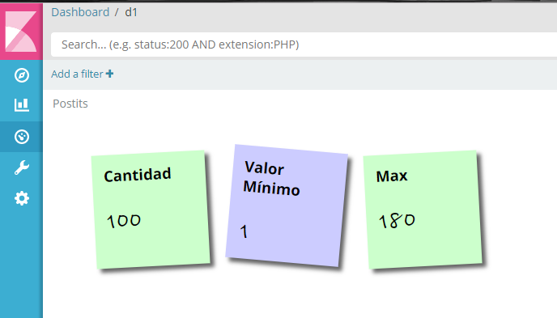

# Kibana Postit Visualization to show little postits with some information

This is a new custom visualization (mainly for Kibana version 5.5.x) that allows
displaying one or more postits (notes) with information from a Metric.

It is based on some code from :

https://code.tutsplus.com/tutorials/create-a-sticky-note-effect-in-5-easy-steps-with-css3-and-html5--net-13934
By Chris Heilmann

If you really liked this and feel like making a donation : 

If you need a modified version, or one that works on a previous (or future) Kibana release,
please let me know.

Example of how it looks:

## Installation Steps

You can just copy the postit_vis folder into KIBANA_HOME/src/core_plugins)
and run kibana.

You will have to re-bundle, if you just start the service or run in non-dev mode.

## How does it work

In order to work this plugins needs a simple Schema configuration:

- At least one (or more) Metric Parameter.

In the options pane, you can change the Font Size of the Labels and the Values.

This plugin uses a specific font from Google Fonts.

## Future changes

- Some animation on the Notes.
- Selecting a color scheme.
